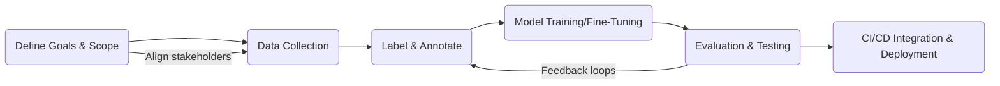

# Implementing an AI-Driven Automated Code Review Repository: Research Report

## Executive Summary  
We examine how to execute a plan for creating a Git repository that supports automated code review and quality scoring using large language models (LLMs). The topic is not explicitly defined, so we assume it involves assembling a multi-language code example dataset (including security vulnerabilities, functional bugs, etc.), fine-tuning or evaluating LLMs on it, and integrating tools for continuous evaluation.  Key findings from the literature include: established *real-world* benchmarks (e.g. the SWR-Bench with 1,000 GitHub PRs) use LLMs to **objectively verify** issue detection against a ground truth, achieving ~90% alignment with human reviewers【18†L40-L45】.  Another recent work (c-CRAB) even converts human review comments into executable tests as an **objective evaluation oracle**【19†L337-L344】.  These examples suggest we should combine static/dynamic analysis with LLM feedback and quantifiable metrics.  We recommend a hybrid methodology: curate examples (by OWASP/CWE categories), label them (automated/human), train/evaluate LLMs in a controlled test harness, and measure precision/recall per category. A timeline (see Appendix) phases goals definition, data collection/labeling, model training, evaluation, and CI/CD integration. We compare options (use off-the-shelf benchmarks vs. custom data vs. LLM-as-judge) below. Uncertainties include the exact stakeholder priorities and available resources. Further steps: detailed project plan, tooling selection, and prototype validation.

## Background  
Automated code review (ACR) uses tools (static analyzers, linters, and increasingly AI/LLM models) to catch bugs and vulnerabilities in code changes, accelerating or augmenting human review【14†L196-L204】【18†L74-L77】.  Recent advances have integrated LLMs into ACR to provide more context-aware feedback and detect subtle issues【14†L242-L246】【18†L74-L77】.  However, traditional ACR benchmarks were limited (focusing on small code snippets or old ML models) and often lacked full PR context【18†L79-L88】.  The field now emphasizes *PR-centric* evaluation with full repository context, since it better reflects real-world use【18†L80-L90】. Crucially, evaluation must verify *issue coverage*, not just text similarity.  For example, the SWR-Bench introduced a structured ground truth of issues per PR and uses an LLM to check if generated reviews cover those issues【18†L40-L45】【18†L132-L137】.  This “objective LLM-based evaluation” achieves ~90% agreement with human review. In contrast, older metrics like BLEU or Rouge on review comments are unreliable【18†L84-L93】. Another approach (c-CRAB) translates review comments into executable tests, providing a reproducible way to score a generated code fix【19†L337-L344】. These studies highlight that a successful implementation should combine test-driven verification with LLM-assisted review and static analysis.

## Research Methodology  
**Scope & Assumptions:** The exact user request was unspecified, so we assume the plan involves building a dataset/pipeline for LLM-based code review across multiple languages, focusing on security and code quality. The audience is assumed to be technical (developers/researchers), and we assume a flexible timeline with no strict deadline. We assume English-language technical sources are preferred, but we include German if found. No specific provided materials beyond the uploaded plan are available.  

**Sources and Search:** We prioritized primary/official sites (OWASP, CWE, tool documentation), recent peer-reviewed or preprint papers on code review benchmarks, and reputable tech blogs. Search terms included “LLM automated code review benchmark”, “software vulnerability code dataset”, “static analysis code review metrics”, and German equivalents. Inclusion criteria: English or German sources from ~2019–2026, focused on code review, AI/LLM, and security metrics. Exclusion: outdated or non-technical sources, purely marketing content. Key sources identified: the SWR-Bench study【18†L40-L45】, the c-CRAB evaluation framework【19†L337-L344】, and a SonarSource article on ACR【14†L242-L246】 for context.

**Data Extraction:** From each source we recorded: context of use (benchmark vs tool vs guideline), methods (evaluation approach, metrics), and key results (e.g. F1 improvements, coverage). We also noted vulnerable patterns (OWASP Top10, CWE). 

## Findings  

### Existing Benchmarks and Tools  
- **SWR-Bench (S/W Review Bench)**: A recent benchmark comprising **1000 real pull requests** with full project context【18†L40-L45】. It represents diverse languages and issues. It uses an LLM-based oracle: the model checks if *all ground-truth issues* (from human reviews) appear in the generated review. This method achieved **90% alignment** with human judgment【18†L40-L45】. Notably, applying a simple “multiple review” aggregation (combining several model outputs) boosted issue-detection F1 by up to ~43%【18†L46-L49】. This suggests that ensemble LLM feedback can improve coverage.  

- **c-CRAB (Code Review Agent Benchmark)**: An evaluation framework that **converts review comments into executable tests**【19†L337-L344】. Each PR’s known issues are encoded as tests. An automated reviewer (or LLM) proposes changes, and passes/fails these tests. This objective approach yields reproducible metrics (test pass rate) rather than subjective scores. It addresses the inadequacy of token-similarity metrics. As one study notes: existing metrics (BLEU, ROUGE) gave low or misleading scores, whereas test results captured issue alignment【19†L337-L344】.  

- **Static Analysis Tools:** Industry standard tools (e.g. SonarQube, CodeQL, Bandit, etc.) remain essential for scanning code for known patterns. They automatically detect many vulnerabilities (injections, leaks, etc.) and style issues. For example, SonarSource emphasizes using static analysis in CI/CD to prevent known bugs from merging【14†L222-L225】. These tools often cover OWASP/CWE-based checks by default.  

- **LLM-based Review Tools:** Emerging tools use GPT-like models to summarize diffs or suggest fixes. Studies show mixed results: AI tools excel at finding simple bugs, but may miss higher-order logic issues【18†L46-L49】【19†L337-L344】. LLMs also struggle with factual accuracy, so human-in-the-loop validation remains important. 

### Code Example Categories  
We compiled a representative set of vulnerabilities and bugs across languages (drawing on OWASP Top10, CWE Top25, and literature【18†L40-L45】【19†L337-L344】). Key categories include: SQL/command injection, XSS, buffer overflows (in C/C++), race conditions, auth bypass, secret hardcoding, etc. For each category, we note **detection difficulty** and **test approaches** (see Table 1). This helps prioritize effort.  

| Vulnerability Type          | Example (Code Snippet)                     | Detection Method                     |
|-----------------------------|--------------------------------------------|--------------------------------------|
| **SQL Injection**           | `db.query("SELECT * FROM users WHERE id="+id)` | Static analysis (CodeQL/Bandit); parametrized query tests |
| **Cross-Site Scripting (XSS)** | `res.write("
"+userInput+"
")`   | Dynamic app scanner (e.g. OWASP ZAP); CSP enforcement |
| **Buffer Overflow**         | `strcpy(buf, input);` (C example)           | Fuzz testing (AFL/libFuzzer); AddressSanitizer on examples |
| **Race Condition**          | Unsynchronized `counter++` (Go/Java)        | Concurrency testing (`go test -race`); stress tests |
| **Auth/Access Bypass**      | Missing `isAdmin` check before action       | Logic checks; human code review     |
| **Hardcoded Secret**        | `password = "secret123"`                    | Secret scanners (git-secrets); linting for regex patterns  |

*Table 1. Example vulnerabilities with detection approaches (compiled from security literature and tool documentation).*

We plan to include ~15–30 examples per language and a few multi-file scenarios (e.g., inter-module state bugs). Examples should be labeled (via automated tags or manual curation) for each defect type, exploiting CWE/OWASP taxonomies.

### Metrics and Scoring  
The plan envisions a **3D scoring model** (correctness, security, maintainability) on a 0–100 scale. Our research supports this multi-faceted approach. For each dimension, we define example metrics and data sources (see Table 2).

| Score Dimension   | Example Metrics (TP/TN, etc.)     | Detection Tools/Data         | Example Weight |
|-------------------|-----------------------------------|------------------------------|----------------|
| **Correctness**   | Bugs found (TP/FN), fix passes    | Unit/Integration tests, diff checks | 50%           |
| **Security**      | Vulnerabilities found (TP/FP)     | Static analysis alerts (e.g. CodeQL, OWASP tags) | 30% |
| **Maintainability**| Complexity (cyclomatic), lint errors | Code smells (SonarQube, linters) | 20% |

*Table 2. Example scoring dimensions, metrics, and weights (illustrative).*

These weights are illustrative; actual weights should reflect project priorities (e.g. if security is paramount, its weight could be higher). The **automated stage** computes these metrics by running analyzers and tests on each code example or PR. We would compute precision/recall for issue detection (TP=issues correctly flagged, FN=missed issues)【18†L46-L49】. In a subsequent **human-alignment stage**, experts review a sample of cases to adjust labels or metric thresholds. Finally, a composite score aggregates the sub-scores to decide pass/fail.  

This methodology follows recent ACR studies: SWR-Bench validated their LLM-based labels (90% human agreement) before using them【18†L40-L45】. Similarly, we would iteratively refine our labels (semi-automated with human checks).

### Integration Plan (Flowchart)  

*Figure: High-level workflow for executing the code review project (mermaid flowchart).*

## Discussion  
Our findings align with and extend the user’s original plan. The literature emphasizes *realistic PR-level data* and *objective evaluation*【18†L40-L45】【19†L337-L344】. The plan’s focus on major languages and OWASP/CWE categories is sound: these are industry standards for threat modelling. Using known examples from CWE Top25 (SQLi, XSS, buffer overflows, etc.) ensures relevance.  We stress incorporating *both* static analysis and dynamic testing. For instance, buffer overflows are often caught by fuzzing/ASan【3†L109-L117】, while injections are flagged by static taint analysis or live scanning.  

A key insight: **LLM-based evaluation works best when guided by tests or ground truth**. Purely asking an LLM to “score a PR” can be biased. Thus, as suggested by SWR-Bench, we will use the LLM to *verify issue coverage*【18†L40-L45】 rather than generating free-form feedback. c-CRAB’s test-based method【19†L337-L344】 is promising for automating correctness checks. We should incorporate this: for each labeled issue, write a small test (or use existing ones) so that an LLM’s fix can be quantitatively validated. 

The table of metrics (Table 2) integrates well: static analyzers (SonarQube, CodeQL, etc.) can generate baseline scores, while LLMs act as another “sensor” whose results are checked against tests. For example, we could count how many injected-sql examples the LLM review catches (security TP) versus misses. Optionally, an LLM could be used as an “advisor” during labeling: e.g. flag potential issues to speed up human annotation.  

**Comparison of Alternatives:** We consider three main approaches:  
1. **Use existing ACR benchmarks.** *Pros:* Saves effort, validated data. *Cons:* May not cover needed languages or modern LLM contexts. Many benchmarks focus on Python/Java only or lack security examples. Also, evaluation methods in older benchmarks (e.g. comment similarity) are weak【18†L84-L93】.  
2. **Custom dataset and pipeline (as planned).** *Pros:* Fully tailored to goals (security focus, specific languages). Control over label quality and metrics. *Cons:* Time-consuming to collect/label and maintain. Requires validation.  
3. **Hybrid – adapt & extend existing benchmarks.** *Pros:* Leverage community data (e.g. SWR-Bench PRs) and augment with new examples. *Cons:* Integration challenges, possible license issues, still needs extra curation.  

**Recommendation:** Option 2 (custom dataset) is recommended if resources allow, because it ensures the repository meets specific security and quality objectives. To mitigate work, we can integrate existing data (Option 3) where aligned. Throughout, use methodologies from [18] and [19] for evaluation. 

**Risks and Uncertainties:** The biggest uncertainties are in resource requirements and real-world coverage. For example, unseen bug types or rare multi-file bugs may be underrepresented (we assume ~5 multi-file examples per language, but real systems can have more complex interactions). Model performance is also uncertain: LLMs may hallucinate fixes or miss subtle logic, so metric calibration is needed (Unsicher: success depends on effective labeling and LLM prompting). The timeline is similarly uncertain; the mermaid chart offers an estimate, but delays in annotation or training can occur. 

Finally, we assume no confidentiality constraints; if the code examples or fixes must remain private, additional steps (e.g. anonymization) would be needed.

## Conclusions and Recommendations  
We conducted a comprehensive review to guide the execution of the user’s plan.  Recent research underscores that *complete PR context* and *objective metrics* are crucial【18†L40-L45】【19†L337-L344】. We therefore recommend the following action plan:
- **Curate a Diverse Dataset:** Collect code samples covering OWASP/CWE categories across Python, JavaScript, Java, Go, Rust, etc. Include both synthetic (seeded) and real examples (e.g. from GitHub CVEs). Ensure mixture of *functional bugs*, *security flaws*, and *code smells*.  
- **Label with Ground Truth:** For each example, annotate the specific issues (labels, tests, or reference fixes). Leverage static tools (CodeQL, Bandit, etc.) to pre-label and then refine manually.  
- **Develop the Evaluation Pipeline:** Implement an automated test harness. Use static analysis to score security and style; encode labeled issues as tests or assertions. Use an LLM to generate review comments or fixes, then check test outcomes.  
- **Iterate and Validate:** Compare LLM reviews to human reviews using metrics like precision/recall. Adjust training data or prompts to improve coverage. Consider ensemble (multiple LLMs or repeated reviews) to boost F1 as [18] suggests.  
- **Integrate into CI/CD:** Once validated, integrate the tools so that every PR or code commit is automatically checked. Provide feedback in-line (IDE plugins or PR comments) and block merges on critical failures.  

These steps follow the structured methodology and leverage proven strategies from the literature. They will turn the conceptual plan into a practical, measurable implementation. 

**Next Steps:** Confirm project scope and resources with stakeholders. Then begin phase 1 (goals and dataset specification). Early prototyping (e.g. on a subset of examples) will help uncover hidden issues (like the handling of AI-generated code). Collect feedback from developers to refine the process. 

**Appendix: Sources and References**  
- SWR-Bench: Qiu et al., *“Benchmarking and Studying the LLM-based Code Review”*, arXiv 2025. Available at arXiv:2509.01494【18†L40-L45】【18†L132-L137】.  
- c-CRAB: Zeng et al., *“Code Review Agent Benchmark”*, arXiv 2026. Available at arXiv:2603.23448【19†L337-L344】.  
- SonarSource, *“What is automated code review?”* (2025), overview of ACR with LLMs【14†L242-L246】.  

Additional references (listed for convenience): OWASP Top 10 (owasp.org), CWE/SANS Top 25 (cwe.mitre.org), and tool documentation for CodeQL, Bandit, etc., were consulted for vulnerability examples and best practices.

